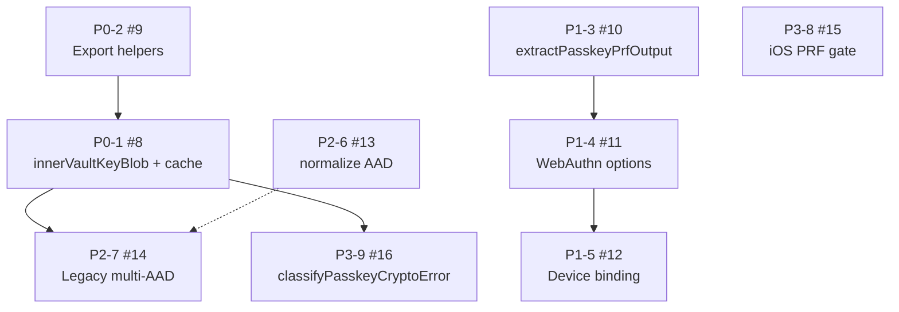

# Registro histórico — implementação vault-core 1.1.0 (passkey PRF)

> [!IMPORTANT]
> **Status: concluído em 2026-07-03. Não execute nem reutilize este prompt.**
> As issues `vault-core` #8–#16 estão encerradas, o SelahKeep concluiu a adoção
> da linha 1.1 e atualmente usa `@tgoliveira/vault-core@^1.3.0`. Para o contrato
> vigente de passkeys sincronizadas, variantes de envelope e bindings por browser,
> consulte [`VAULT_CORE_1_3_ADOPTION.md`](./VAULT_CORE_1_3_ADOPTION.md).

Este arquivo preserva o briefing original como histórico de decisão e rastreabilidade.
Versões, comandos e instruções imperativas dentro do bloco abaixo descrevem o estado
anterior à implementação e não constituem orientação operacional atual.

---

## Escopo histórico deste documento

O bloco abaixo foi usado como instrução de implementação no repositório
**[tgoliveira11/vault-core](https://github.com/tgoliveira11/vault-core)**. Ele é
mantido sem atualizar seu conteúdo interno para preservar o contexto das decisões
que resultaram nas issues #8–#16.

O backlog local original foi retirado após a conclusão. As issues encerradas no
`vault-core` e os documentos atuais do pacote são as fontes de rastreabilidade.

---

--- INÍCIO DO PROMPT ---

# Missão: implementar issues #8–#16 (passkey PRF gaps) → `@tgoliveira/vault-core@1.1.0`

## 1. Contexto

### O que é vault-core

`@tgoliveira/vault-core` é a biblioteca framework-agnostic de criptografia de vault (envelopes password/recovery/passkey PRF, UVK, rotação, validação AAD, sessão browser, helpers React). Entry points públicos:

| Import | Responsabilidade |
| --- | --- |
| `@tgoliveira/vault-core` | Crypto, envelopes, recovery, rotation, admin config, schemas, AAD, validation |
| `@tgoliveira/vault-core/browser` | Sessão browser, PRF salt, helpers de unlock, storage inspection |
| `@tgoliveira/vault-core/react` | `VaultSessionProvider`, status dock, unlock panel, admin UI |
| `@tgoliveira/vault-core/testing` | Sentinelas e leak detection |

Versão atual publicada: **1.0.1**. Versão alvo deste épico: **1.1.0** (minor — APIs novas, sem breaking desnecessário).

### Por que estas issues existem

Auditoria de passkey PRF no SelahKeep (PRs **#29–#46**, jul/2026) identificou **duplicação** entre o app e o pacote após a migração 1.0.0:

- UVK de sessão **não-extraível** (`VaultKeyNotExtractableError`) sem API pública para re-wrap PRF pós-unlock.
- Helpers de `vault-key-envelope` existem em `dist/crypto/` mas **não** no entry principal.
- Extração PRF ingênua (`results.first` apenas) — falha em Safari/iOS com `evalByCredential`.
- Cerimônia WebAuthn (align PRF, platform transports) reimplementada no app.
- Device binding (cookie + DB) no app sem contrato portável no core.
- Normalização AAD e unlock legacy multi-AAD duplicados (~400+ linhas).
- Gate iOS PRF &lt; 18 e classificação de erros crypto duplicados.

O backlog SelahKeep virou **9 issues GitHub** no vault-core:

| ID backlog | Issue GitHub | Título |
| --- | --- | --- |
| P0-1 | [#8](https://github.com/tgoliveira11/vault-core/issues/8) | `createPasskeyPrfEnvelope` + `innerVaultKeyBlob` + cache de sessão |
| P0-2 | [#9](https://github.com/tgoliveira11/vault-core/issues/9) | Exportar helpers `vault-key-envelope` |
| P1-3 | [#10](https://github.com/tgoliveira11/vault-core/issues/10) | `extractPasskeyPrfOutput` robusto |
| P1-4 | [#11](https://github.com/tgoliveira11/vault-core/issues/11) | `alignPrfExtensions` + platform transports |
| P1-5 | [#12](https://github.com/tgoliveira11/vault-core/issues/12) | Padrão portável device binding |
| P2-6 | [#13](https://github.com/tgoliveira11/vault-core/issues/13) | `normalizeEnvelopeAadContext` |
| P2-7 | [#14](https://github.com/tgoliveira11/vault-core/issues/14) | Unlock legacy `vault_key` multi-AAD |
| P3-8 | [#15](https://github.com/tgoliveira11/vault-core/issues/15) | `isPrfExtensionSupported` com UA/iOS |
| P3-9 | [#16](https://github.com/tgoliveira11/vault-core/issues/16) | `classifyPasskeyCryptoError` |

Documentação de referência no pacote: `AGENTS.md`, `SECURITY.md`, `API_REFERENCE.md`, `docs/IMPLEMENTATION_GUIDE.md`, `docs/CONSUMER_SECURITY_REQUIREMENTS.md`, `docs/CURRENT_PRODUCT_SURFACE.md`. Padrões cripto alinhados a **ADR-005** (Argon2id, note keys, recovery) e **ADR-006** (passkey PRF unlock) — espelhados no SelahKeep em `docs/ADR-005_*` e `docs/archive/ADR-006_*`.

---

## 2. Regras obrigatórias para o agente

1. **Leia antes de codar:** `AGENTS.md`, `SECURITY.md`, `API_REFERENCE.md`, `docs/IMPLEMENTATION_GUIDE.md`, issue GitHub correspondente e seção do backlog SelahKeep.
2. **Idioma do código:** inglês (identificadores, erros, testes, comentários, docs do pacote) — conforme `AGENTS.md` do vault-core.
3. **Sem breaking changes** sem bump major e nota explícita no CHANGELOG. Parâmetros novos sempre **opcionais no final**. Defaults retrocompatíveis (`passkeyUnlockAvailableOnThisDevice` omitido = comportamento 1.0.x).
4. **Semver:** este épico = **1.1.0** minor. Comportamento mais restritivo em iOS &lt; 18 (P3-8) = minor com nota CHANGELOG.
5. **Entry points:** respeite a tabela de imports acima. Não acople ORM, cookies nomeados, rotas HTTP ou copy de produto ao core.
6. **Browser vs Node:**
   - APIs puras (crypto, envelopes, validação) → `@tgoliveira/vault-core`
   - `navigator`, DOM, session cache, WebAuthn prep → `@tgoliveira/vault-core/browser`
   - Dock/status React → `@tgoliveira/vault-core/react`
7. **Segurança inegociável:**
   - Nunca persistir UVK, PRF output, inner key material, senha ou recovery phrase em `localStorage`/`sessionStorage`/IndexedDB.
   - Cache de inner key material = **memória apenas**, limpo em `lockVaultSession` / `lockVaultSessionManually`.
   - Plaintext de vault nunca vai ao servidor.
8. **Estrutura do pacote:** siga layout existente em `src/` (`envelopes/`, `crypto/`, `session/`, `browser/`, `react/`, `errors/`, `validation/`, `passkey/`). Novos módulos seguem convenção `.ts` + re-export nos barrels (`index.ts`, `browser.ts`, `react/index.ts`).
9. **Exports:** toda API pública nova deve aparecer em `src/index.ts` ou `src/browser.ts` (ou subpath documentado), e em `scripts/verify-public-exports.mjs`. Rode `npm run verify:public-exports` após cada issue.
10. **Testes:** cobertura **≥ 90%** por arquivo de produção (vitest). Porte casos do SelahKeep quando indicado — adapte imports para o pacote, não copie paths do app.
11. **Um PR por issue** (ou um PR por fase se o owner pedir), branch `feature/` ou `fix/` a partir de `main`. **Não** commitar em `main`, **não** publicar npm sem aprovação explícita.
12. **Validação final por issue:** `npm run validate` verde antes de marcar issue como concluída.

---

## 3. Ordem de execução e dependências



### Sequência recomendada (estrita)

| Ordem | Issue | Pode paralelizar com |
| --- | --- | --- |
| **1** | P0-2 (#9) | — (comece aqui) |
| **2** | P0-1 (#8) | início de P0-2 se exports já merged |
| **3a** | P1-3 (#10) | P2-6 (#13), P3-8 (#15) |
| **3b** | P1-4 (#11) | após P1-3 |
| **3c** | P1-5 (#12) | após P1-4 |
| **4a** | P2-6 (#13) | P1-3, P3-8 |
| **4b** | P2-7 (#14) | após P0-1 e P2-6 |
| **5a** | P3-8 (#15) | P1-3 em diante |
| **5b** | P3-9 (#16) | após P0-1 |

**Fases de release (sugerido):**

| Fase | Issues | Tag consumidor |
| --- | --- | --- |
| 1 | P0-2, P0-1 | `^1.1.0` — enroll passkey pós-unlock |
| 2 | P1-3, P1-4, P1-5 | `^1.1.0` — cerimônia + device binding |
| 3 | P2-6, P2-7 | `^1.1.0` — legacy AAD |
| 4 | P3-8, P3-9 | `^1.1.0` — UX gates e erros |

---

## 4. Brief por issue

### P0-2 — Exportar helpers `vault-key-envelope` ([#9](https://github.com/tgoliveira11/vault-core/issues/9))

**Objetivo:** Expor no entry principal helpers que já existem em `dist/crypto/vault-key-envelope.d.ts` para consumidores não importarem paths internos.

**Arquivos:**
- `src/index.ts` — `export { ... } from "./crypto/vault-key-envelope.js"`
- `scripts/verify-public-exports.mjs` — allowlist
- `API_REFERENCE.md`, `CHANGELOG.md` `[Unreleased]`

**APIs a exportar:**
- `assertInnerVaultKeyBlobMatchesVaultKey`
- `extractInnerVaultKeyBlob`
- `rewrapInnerVaultKeyMaterialForDerivedKeys`
- `rewrapEncryptedVaultKeyForDerivedKeys`
- `wrapUserVaultKeyWithPrfOutput`
- `unwrapUserVaultKeyWithPrfOutput`
- tipo `WrapUserVaultKeyOptions`
- *(após P0-1)* `rewrapInnerVaultKeyMaterialForPrfOutput`

**Testes:** `src/test/security/public-exports.test.ts` — importar símbolos do package root.

**Definição de pronto:**
- [ ] `npm run verify:public-exports` inclui todos os símbolos
- [ ] Nenhum import `dist/crypto/*` necessário nos consumidores
- [ ] `API_REFERENCE.md` documenta cada helper e quando usar

---

### P0-1 — `createPasskeyPrfEnvelope` + cache de sessão ([#8](https://github.com/tgoliveira11/vault-core/issues/8))

**Objetivo:** Permitir enroll passkey **após** unlock por senha/recovery com UVK non-extractable, via `innerVaultKeyBlob` e cache em memória.

**Arquivos:**
- `src/envelopes/passkey-prf.ts` — `options?: WrapUserVaultKeyOptions` em `createPasskeyPrfEnvelope`; opcional `createPasskeyPrfEnvelopeWithSessionCache`
- `src/crypto/vault-key-envelope.ts` — `rewrapInnerVaultKeyMaterialForPrfOutput(...)`
- `src/session/inner-key-material-cache.ts` — novo
- `src/session/auto-lock.ts` — `clear` no lock
- `src/browser/inner-key-material-cache.ts` — re-export + `cacheVaultInnerKeyMaterialFromPasskeyUnlock`
- `src/browser.ts` — exports do cache
- `docs/IMPLEMENTATION_GUIDE.md` § passkey enroll pós-unlock

**APIs:**
- `createPasskeyPrfEnvelope(..., publicMetadata?, options?: { innerVaultKeyBlob?: Uint8Array })`
- `VaultInnerKeyMaterialCache`: `cacheFromEnvelopeDecrypt`, `cacheFromPasskeyEnvelope`, `getCached`, `clear`
- Erro acionável exportável para cache stale (mismatch UVK)
- Hooks/callbacks documentados: após `unlockWithPasswordEnvelope` / `unlockWithRecoveryPhraseEnvelope` / `unlockWithPasskeyPrfEnvelope` → cache populado

**Testes:**
- `src/test/unit/envelopes/passkey-prf-inner-blob.test.ts`
- `src/test/unit/session/inner-key-material-cache.test.ts`
- Smoke: unlock password → `createPasskeyPrfEnvelope` → sucesso sem `VaultKeyNotExtractableError`

**Definição de pronto:**
- [ ] `lockVaultSession()` e `lockVaultSessionManually()` limpam cache
- [ ] Cache nunca persiste em storage
- [ ] P0-2 exporta `rewrapInnerVaultKeyMaterialForPrfOutput`

---

### P1-3 — `extractPasskeyPrfOutput` robusto ([#10](https://github.com/tgoliveira11/vault-core/issues/10))

**Objetivo:** Extrair PRF bytes corretos quando Safari/iOS popula `evalByCredential` e `results.first` refere outra credencial.

**Arquivos:**
- `src/envelopes/passkey-prf-output.ts` — novo módulo puro
- `src/envelopes/passkey-prf.ts` — re-export; remover lógica inline
- `src/index.ts`, `src/browser.ts` — re-export

**API:**
```ts
extractPasskeyPrfOutput(
  results: AuthenticationExtensionsClientOutputs,
  options?: { credentialId?: string }
): Uint8Array | null
```
Ordem: `evalByCredential[credentialId].first` → `results.first` → primeiro `.first` no mapa. Coerção: `ArrayBuffer`, `ArrayBufferView`, base64url `string`, `number[]` (≥32). Saída: 32 bytes ou `null`.

**Testes:** fixtures Safari (`eval` + `evalByCredential`), base64url, `credentialId` ausente. Porte de `selahkeep/src/test/unit/normalize-prf-output.test.ts` e `crypto-passkey-vault.test.ts`.

**Definição de pronto:**
- [ ] Exportado em root e `/browser`
- [ ] Comportamento coberto por testes Safari-like

---

### P1-4 — WebAuthn PRF options + platform transports ([#11](https://github.com/tgoliveira11/vault-core/issues/11))

**Objetivo:** iOS single-credential usa `eval` não `evalByCredential`; iPhone evita hybrid transport que completa WebAuthn mas falha PRF unwrap.

**Arquivos:**
- `src/browser/webauthn-prf-options.ts` — `prepareWebAuthnPrfExtensions`, `alignPrfExtensionsForCredential`
- `src/browser/vault-unlock-transports.ts` — `preferPlatformTransportsForVaultUnlock`, `toVaultUnlockAllowCredentialDescriptor`
- `src/browser/vault-unlock-auth-options.ts` — `prepareVaultUnlockAuthenticationOptions`
- `src/browser.ts` — exports
- `docs/IMPLEMENTATION_GUIDE.md` — substituir texto “app-owned ceremony helpers”

**APIs (`@tgoliveira/vault-core/browser`):**
- `prepareWebAuthnPrfExtensions(extensions)` — JSON salts → `ArrayBuffer`
- `alignPrfExtensionsForCredential(options, credentialId?)`
- `preferPlatformTransportsForVaultUnlock(options, userAgent?)` — pin `internal` só em Apple mobile (`iPhone|iPod|iPad`)
- `prepareVaultUnlockAuthenticationOptions(options, { credentialId?, userAgent? })`

**Testes:** `src/test/unit/browser/webauthn-prf-options.test.ts`, `vault-unlock-transports.test.ts`. Porte SelahKeep `prepare-webauthn-options.test.ts`, `passkey-vault-unlock-prf-parity.test.ts`.

**Definição de pronto:**
- [ ] Tipos genéricos compatíveis com JSON `@simplewebauthn/browser` (sem acoplar versão server)
- [ ] `userAgent` default `navigator.userAgent` no browser; obrigatório em SSR/tests

---

### P1-5 — Device binding portável ([#12](https://github.com/tgoliveira11/vault-core/issues/12))

**Objetivo:** Contrato portável para “passkey unlock neste browser” sem ORM/cookie no core.

**Arquivos:**
- `src/passkey/device-binding/types.ts` — `VaultDeviceBindingStore`
- `src/passkey/device-binding/scope-auth-options.ts` — `scopeAuthenticationOptionsToDevice`
- `src/passkey/device-binding/resolve-availability.ts` — `resolvePasskeyUnlockAvailableOnDevice`
- `src/passkey/device-binding/parse-binding-id.ts` — `parseDeviceBindingId`, `buildDeviceBindingCookieOptions`
- `src/react/status-dock/resolve-passkey-dock-availability.ts` — flag `passkeyUnlockAvailableOnThisDevice`
- `src/react/status/resolve-vault-client-status.ts` — estender `VaultServerStatusSnapshot`
- `docs/examples/device-binding/README.md` + SQL/cookie pseudocódigo
- `docs/CURRENT_PRODUCT_SURFACE.md`

**APIs:**
- `VaultDeviceBindingStore`: `resolveBindingForUser`, `bindPasskeyToDevice`, `touchLastUsed`
- `scopeAuthenticationOptionsToDevice(options, { credentialId })` — compõe com P1-4
- `VaultServerStatusSnapshot.passkeyUnlockAvailableOnThisDevice?: boolean` (omitido = `true` retrocompat)
- `resolveVaultDockPasskeyAvailability`: `hasEnvelope && prfSupported && passkeyUnlockAvailableOnThisDevice !== false`

**Testes:**
- Envelope sem binding → `showPasskey: false`, `prfExplicitlyUnsupported: false`
- Binding ativo → `showPasskey: true`
- Scope multi `allowCredentials` → single após binding

**Definição de pronto:**
- [ ] Exemplo em `docs/examples/device-binding/` (não dependência runtime)
- [ ] Apps multi-device devem passar `false` explicitamente quando sem binding

---

### P2-6 — `normalizeEnvelopeAadContext` ([#13](https://github.com/tgoliveira11/vault-core/issues/13))

**Objetivo:** Envelopes `vault_key` salvos sem `aad.context` (null/undefined) devem unlock após injeção do profile context — sem bypass de segurança para context **diferente**.

**Arquivos:**
- `src/validation/envelope-aad-normalize.ts` — `normalizeEnvelopeAadContext(payload, profile)`
- `src/envelopes/passkey-prf.ts` — chamar antes de `assertVaultKeyAad` em unwrap/unlock
- `src/index.ts` — export
- `docs/IMPLEMENTATION_GUIDE.md` ou ADR interno — envelopes com context errado → P2-7

**API:**
- `normalizeEnvelopeAadContext` — injeta `profile.aadContextEnvelope` quando `field === "vault_key"` e `context` é null/undefined
- `unlockWithPasskeyPrfEnvelope` / unwrap: normalização automática; opt-out `strictAad: true` para testes

**Testes:** porte `selahkeep/src/test/unit/passkey-vault-key-aad-context-unlock.test.ts`

**Definição de pronto:**
- [ ] Context explícito diferente do profile → continua erro
- [ ] Sem breaking change (só null/undefined)

---

### P2-7 — Legacy `vault_key` multi-AAD ([#14](https://github.com/tgoliveira11/vault-core/issues/14))

**Objetivo:** Dados pré-profile e variantes de serialização AAD via `aadByteCandidates` — sem strings `selahkeep:*` no core.

**Arquivos:**
- `src/envelopes/legacy-vault-key-unlock.ts` — `isLegacyVaultKeyEnvelope`, `unwrapVaultKeyWithLegacyAadFallback`
- `src/profile.ts` — `legacyVaultKeyUnlock?: boolean` (default `true` em 1.1)
- `src/envelopes/passkey-prf.ts`, `password.ts`, `recovery.ts` — roteador automático
- `docs/MIGRATION_LEGACY_VAULT_KEY.md`

**APIs:**
- `isLegacyVaultKeyEnvelope(payload, profile)` — missing/null context ou context ≠ profile
- `unwrapVaultKeyWithLegacyAadFallback(payload, decryptFn, scope)` — candidatos multi-AAD
- Integração cache P0-1 no path legacy raw 32-byte

**Testes:** porte `legacy-envelope-unlock` + multi-AAD; sentinel em decrypt.

**Definição de pronto:**
- [ ] Sunset documentado: `legacyVaultKeyUnlock: false` quando migração completa
- [ ] Depende de P0-1 e beneficia de P2-6

---

### P3-8 — `isPrfExtensionSupported` + iOS ([#15](https://github.com/tgoliveira11/vault-core/issues/15))

**Objetivo:** Não oferecer passkey PRF em iOS/iPadOS &lt; 18 onde WebAuthn existe mas PRF não.

**Arquivos:**
- `src/envelopes/passkey-prf-support.ts` — gate + UA parsing
- `src/envelopes/passkey-prf.ts` — delegar `isPrfExtensionSupported`
- `src/browser.ts` — re-export
- `src/react/status-dock/resolve-passkey-dock-availability.ts` — usar gate automaticamente

**APIs:**
- `isPrfExtensionSupported(options?: { userAgent?: string; minAppleMobileMajorVersion?: number })`
- `DEFAULT_APPLE_MOBILE_PRF_MIN_MAJOR_VERSION = 18`
- `parseAppleMobileOsMajorVersion(userAgent): number | null`

**Testes:** iOS 17 → false; iOS 18+ → true; desktop inalterado. Porte `prf-support.test.ts`.

**Definição de pronto:**
- [ ] CHANGELOG nota comportamento mais restritivo em iOS antigo (minor)

---

### P3-9 — `classifyPasskeyCryptoError` ([#16](https://github.com/tgoliveira11/vault-core/issues/16))

**Objetivo:** Classificador unificado de falhas crypto passkey (unwrap + cerimônia), complementar a `classifyPasskeyUnlockFailure` (dock UX).

**Arquivos:**
- `src/errors/passkey-crypto-failure.ts`
- `src/index.ts` — export
- `src/react/status-dock/` — opcional: mensagens inline em `VaultDockQuickUnlock`
- `API_REFERENCE.md` — relação com `classifyPasskeyUnlockFailure`

**APIs:**
- `PasskeyCryptoFailureKind`: `prf_mismatch` | `rewrap_requires_unlock` | `decrypt_failed` | `unknown`
- `classifyPasskeyCryptoError(error: unknown): PasskeyCryptoFailureKind`
- `getDefaultPasskeyCryptoErrorMessage(kind, locale?: string): string` — inglês neutro, i18n-ready; **sem** copy SelahKeep

**Mapeamentos:** `VaultKeyNotExtractableError`, inner blob mismatch, `OperationError`/`DataError`, `PasskeyUnlockError`.

**Testes:** `src/test/unit/errors/passkey-crypto-failure.test.ts`. Porte `map-passkey-crypto-error.test.ts`.

**Definição de pronto:**
- [ ] `rewrap_requires_unlock` alinhado às mensagens do cache P0-1
- [ ] Depende de P0-1

---

## 5. Requisitos transversais (todas as issues)

### `package.json` exports

Manter entries existentes (`.`, `./browser`, `./react`, `./testing`, `./vault-admin.css`). Novos subpaths só se necessário (ex.: `passkey-binding`) — documentar em `API_REFERENCE.md` e `verify-public-exports`.

### CHANGELOG

Cada issue: entrada em `CHANGELOG.md` → `## [Unreleased]` com:
- APIs novas/estendidas
- Comportamento alterado (ex.: iOS gate)
- Notas de migração para consumidores

### API_REFERENCE.md

Documentar assinaturas, pré-condições de segurança, entry point correto, relação entre classifiers (`classifyPasskeyUnlockFailure` vs `classifyPasskeyCryptoError`).

### docs/CURRENT_PRODUCT_SURFACE.md

Atualizar inventário de exports e status shipped/planned após cada issue que altera superfície pública.

### Notas de migração (consumidor SelahKeep)

Publicar em `docs/IMPLEMENTATION_GUIDE.md` ou `docs/ADOPTING_VAULT_CORE_IN_EXISTING_APPS.md`:
- O que deletar no app após cada fase (ver seção 7 abaixo)
- O que permanece app-owned: rotas API, Drizzle, `SELAHKEEP_VAULT_PROFILE`, copy Stillness, `purpose: "vault_unlock"`, prefetch iOS

### Política crypto

- Argon2id para novos paths KDF (sem PBKDF2 fallback para vault password/recovery novos)
- PRF → AES-KW 256 conforme implementação existente
- Sentinel tests: plaintext nunca em logs/respostas

---

## 6. Checklist de validação (cada PR / antes de release 1.1.0)

```bash
npm ci
npm run typecheck
npm run verify:crypto-policy
npm run verify:public-exports
npm run test:coverage    # ≥90% por arquivo de produção
npm run build
node scripts/verify-public-exports.mjs --dist
npm run validate
npm pack --dry-run       # quando exports ou files mudarem
```

### Testes browser-specific

- Vitest + jsdom para módulos `src/browser/*` e cache de sessão
- Fixtures com `userAgent` explícito (não depender de `navigator` em Node)
- Casos Safari: `evalByCredential` + `results.first` concorrentes

### Smoke test consumidor (manual ou em SelahKeep após publish)

1. Unlock vault por senha → enroll passkey → sucesso (P0)
2. Unlock passkey em iOS simulator/real com credential scoping (P1)
3. Dock não mostra passkey sem device binding neste browser (P1-5)
4. Unlock envelope legado sem `aad.context` (P2)
5. iOS 17 UA → passkey oculto no dock (P3-8)
6. PRF mismatch → `classifyPasskeyCryptoError` → `prf_mismatch` (P3-9)

---

## 7. Pós-implementação — adoção no SelahKeep (fora deste repo)

Após publicar `@tgoliveira/vault-core@^1.1.0`, o consumidor SelahKeep deve:

### Fase 1 (P0-2 + P0-1)

| Ação | Arquivo SelahKeep |
| --- | --- |
| **Deletar** | `src/modules/vault/core/envelopes/vault-inner-key-material.ts` |
| **Simplificar** | `src/modules/vault/core/envelopes/passkey-prf-envelope.ts` — usar `createPasskeyPrfEnvelope` + cache browser |
| **Simplificar** | `src/modules/vault/core/envelopes/password-envelope.ts`, `recovery-envelope.ts` — cache do core |
| **Atualizar testes** | `src/test/unit/vault-inner-key-material*.test.ts` → assert APIs vault-core |
| **Bump** | `package.json` → `"@tgoliveira/vault-core": "^1.1.0"` |

### Fase 2 (P1-3 + P1-4 + P1-5)

| Ação | Arquivo SelahKeep |
| --- | --- |
| **Deletar** | `src/lib/passkey/normalize-prf-output.ts` |
| **Deletar ou re-export** | `src/lib/passkey/prepare-webauthn-options.ts` |
| **Simplificar** | `src/lib/passkey/passkey-transports.ts` (manter só o que for app-specific) |
| **Deletar** | `src/features/vault/use-vault-dock-passkey-available.ts` |
| **Simplificar** | `src/lib/crypto-client/vault-passkey-browser.ts` — re-exports finos |
| **Simplificar** | `src/lib/passkey/vault-unlock-authenticate.ts` — `prepareVaultUnlockAuthenticationOptions` |
| **Simplificar** | `src/server/services/passkey-service.ts` — `scopeAuthenticationOptionsToDevice` |
| **Atualizar** | `GET /api/vault/status` — `passkeyUnlockAvailableOnThisDevice` no snapshot |
| **Manter app-owned** | `vault-passkey-device-binding-*`, cookie `selahkeep_vault_device`, Drizzle `0020_*` |
| **Atualizar testes** | `normalize-prf-output.test.ts`, `prepare-webauthn-options.test.ts`, `passkey-transports.test.ts`, `vault-dock-passkey-device-binding.test.ts` |

### Fase 3 (P2-6 + P2-7)

| Ação | Arquivo SelahKeep |
| --- | --- |
| **Deletar** | `src/modules/vault/core/envelopes/legacy-envelope-unlock.ts` (maior parte) |
| **Simplificar** | `passkey-prf-envelope.ts` — remover `normalizeVaultKeyEnvelopeAadContext`, `shouldRoutePasskeyVaultKeyToLegacyUnlock` |
| **Manter** | `src/modules/vault/selahkeep-profile.ts` — `legacyVaultKeyUnlock: true` até migração 100% |
| **Atualizar testes** | `legacy-vault-envelope-unlock.test.ts`, `passkey-vault-key-aad-context-unlock.test.ts` |

### Fase 4 (P3-8 + P3-9)

| Ação | Arquivo SelahKeep |
| --- | --- |
| **Deletar ou wrapper** | `src/lib/passkey/prf-support.ts` (manter `detectPasskeyPrfSupport` só se UX app) |
| **Substituir** | `src/lib/passkey/map-passkey-crypto-error.ts` — wrapper Stillness sobre `getDefaultPasskeyCryptoErrorMessage` |
| **Simplificar** | `src/features/passkey/unlock-with-passkey.ts` |
| **Manter app-owned** | `src/lib/passkey/messages.ts` (copy Apple-specific, Stillness) |
| **Atualizar testes** | `prf-support.test.ts`, `map-passkey-crypto-error.test.ts` |

### Validação SelahKeep pós-adoção

```bash
npm run validate
```

Atualizar:
- `CHANGELOG.md` `[Unreleased]`
- `docs/VAULT_CORE_1_0_0_COMPLIANCE_GAP.md` — status “passkey PRF gaps resolvidos”
- `docs/CURRENT_PRODUCT_SURFACE.md` se rotas/API mudarem

---

## 8. Definição de pronto do épico

- [ ] Issues #8–#16 implementadas e publicadas em `@tgoliveira/vault-core@^1.1.0`
- [ ] `npm run validate` verde no vault-core
- [ ] `verify:public-exports` cobre todas as APIs novas
- [ ] `API_REFERENCE.md` e `docs/CURRENT_PRODUCT_SURFACE.md` atualizados
- [ ] `docs/MIGRATION_LEGACY_VAULT_KEY.md` e `docs/examples/device-binding/` presentes
- [ ] SelahKeep pode remover módulos duplicados por fase (seção 7)
- [ ] Nenhum breaking change não documentado

---

## 9. Fora de escopo (não implementar neste épico)

- Rotas API, Drizzle, repositórios, rate limit de produto além dos exports vault-core
- `purpose: "vault_unlock"` e verificação `@simplewebauthn/server`
- Prefetch com gesto iOS (`use-vault-passkey-unlock-prefetch.ts`)
- Profile `SELAHKEEP_VAULT_PROFILE` e prefixo PRF `letters-passkey-prf-v1:`
- Cripto de notas, kanban, MCP
- Copy Stillness / mensagens Apple-specific do SelahKeep

---

**Instrução histórica original:** começar pela issue
[#9 (P0-2)](https://github.com/tgoliveira11/vault-core/issues/9) e seguir a ordem
da seção 3. Essa sequência foi concluída e não deve ser iniciada novamente.

--- FIM DO PROMPT ---
